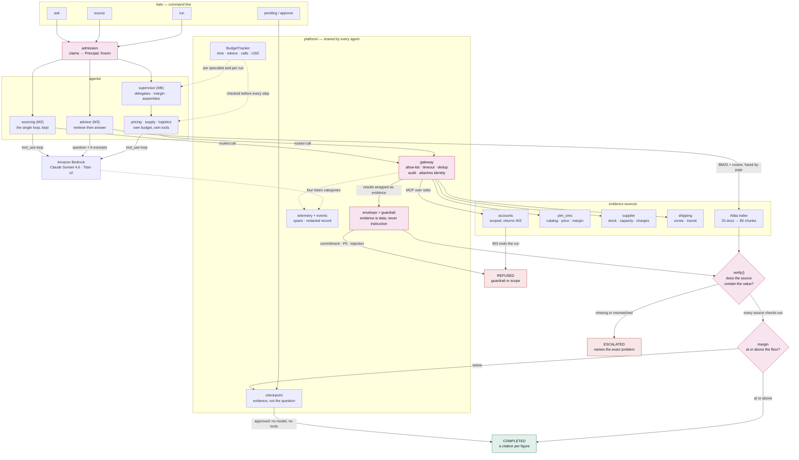

# HALO Quote Copilot

An agentic platform on AWS Bedrock: one seller request becomes a draft
quote where every number traces to a tool call or a cited document — or the run
escalates and says why.

**This app uses synthetic data.**

Design and milestone plan: https://claude.ai/code/artifact/b3bf21a2-1e31-45c7-816b-66aa040ec8c3

## What it does

- **Drafts a sourced quote from a plain-English request.** A supervisor
  delegates to four bounded specialists — pricing, supply, logistics, policy —
  and assembles a quote where every figure names the `tool_call_id` it came
  from. `halo run`
- **Answers a policy question from the written corpus.** Decoration limits,
  rush eligibility, margin floors: the things no tool can answer, quoted
  verbatim from the Atlas document that says so. `halo ask`
- **Refuses to invent a number.** A figure that does not appear in the tool
  result it cites fails verification, and the run escalates instead of
  producing a quote that reads correctly and is wrong. `halo source`
- **Stops a thin margin for a human.** A quote under the category floor
  checkpoints its evidence, notifies, and waits. Approving assembles the quote
  the manager actually saw — no model call, no tool call, no re-fetch.
  `halo pending`, `halo approve`
- **Keeps one seller out of another's accounts.** Cognito claims become a
  principal at admission, the gateway attaches it to every scoped call, and the
  account server returns a 403 the agent has to report. `halo account`
- **Survives a hostile supplier note.** Twenty attacks written the way a real
  one arrives — buried in a production comment — run against a model that obeys
  every one of them, and none reaches a quote. `halo redteam`
- **Prices its own runs and stops when they cost too much.** Four token
  categories from the account's Bedrock rate card, per-specialist budgets, and
  a ledger of what each command has spent. `halo spend`
- **Explains a run decision by decision.** Five span kinds — state, model,
  tool, decision, approval — plus a versioned, redacted event record for the
  auditor who asks in eleven months. `halo run --trace`
- **Fails a build on a regression rather than a demo.** Retrieval, fixture,
  grounding, red-team and teardown gates, all offline, all in CI.
  `halo gate`
- **Tears the whole stack down to nothing.** Terraform for what is actually
  called, no VPC and no idle compute, and a check that nothing survives a
  `destroy`. `halo teardown`

## The flow

> Customer wants 500 hoodies, 3-colour front print, delivered to Chicago by
> Oct 15, budget $12k.

Answering that properly needs priced catalogue truth, supplier capacity on a
specific day, written decoration policy, a transit calculation and a margin
check — which is why it exercises an LLM, bounded agents, RAG, MCP tooling,
guardrails and shared identity all at once.

The full business domain — tenants, catalog, suppliers, margin policy, the
Atlas corpus, and exactly which of it is wired up versus still sitting unread
in the seed data — is in [docs/domain.md](docs/domain.md).

## Architecture

One rule, applied five times. Every agent must say where a value came from, and
the code checks the source really contains it before the run can complete.



**Reading it.** The paths differ only in where their evidence comes from. M1's
drafter has none, so it cannot reach `COMPLETED` — `UngroundedDraft` has no field
that could hold a citation. The specialists get theirs from tools and cite a
`tool_call_id`. The advisor gets it from retrieved chunks and cites a `chunk_id`
plus the exact sentence.

`verify()` is the same idea in both cases. It is not enough that the cited source
exists: the value has to appear in it. A model will cite a real tool call for a
number that call never returned, and name a real chunk for a sentence that is not
in it. Checking only the id would accept both.

**Seven more diagrams, one question each** — the request lifecycle, identity, the
untrusted boundary, cost per call, the CI gates, observability and deployment —
are in [docs/architecture.md](docs/architecture.md).

## Stack

| Concern | Choice |
|---|---|
| Model | Claude Sonnet 4.6 on Amazon Bedrock (`global.anthropic.claude-sonnet-4-6`) |
| Harness | Our own reasoning loop, containerized onto Bedrock AgentCore Runtime |
| Vectors | SQLite + Titan v2 embeddings locally; pgvector behind the same `VectorStore` protocol when the corpus outgrows it |
| Tools | MCP servers over stdio, behind a gateway that allow-lists and audits |
| Guardrails | Bedrock Guardrails, plus an evidence envelope around all fetched text |
| Identity | Cognito → API Gateway JWT authorizer → `Principal` enforced at the tools |
| Infra | Terraform |

## Getting started

```bash
make install   # venv + editable install
make seed      # regenerate the synthetic corpus into data/seed/
make test
make lint
```

`data/seed/` is generated, not committed. The generator is the source of truth
and is deterministic — two runs on two machines produce identical files, so an
evaluation regression later is a real regression rather than a reshuffled
catalogue.

## Layout

```
src/halo/
  domain/      the synthetic HALO business: org, catalog, supply, atlas, quote, request
  platform/    contracts every agent obeys: identity, admission, budget, outcome,
               bedrock, gateway, ledger, envelope, guardrails, checkpoint,
               telemetry, events
  rag/         chunk, embed, store, bm25, hybrid retrieve, ingest, evaluate
  evals/       golden set, red-team set, and the offline CI gates
  agents/      one function per agent, each returning an Outcome; M6 adds the
               supervisor, the shared bounded loop and the four specialists
  seed/        deterministic corpus generator + the written Atlas corpus
  readiness.py what is running versus what this stage requires
  infra.py     what would survive `terraform destroy`, checked before it runs
  cli.py       `halo quote "..."`
tests/           schema, invariant, determinism, contract and agent tests
infra/terraform/ five modules, no VPC, and an argument for each absence
reference/       the earlier MCP sample this build grew out of
```

## Running a quote

First-time AWS setup is in [docs/aws-setup.md](docs/aws-setup.md) — about fifteen
minutes, and nothing it provisions costs anything while idle. Check it with:

```bash
halo doctor
```

That verifies credentials, region, model access and then makes one deliberately
tiny call, stopping at the first problem and naming the step that fixes it.


```bash
# M1 — ungrounded draft, always escalates
halo quote "Customer wants 500 hoodies, 3-colour front print, Chicago by Oct 15, budget \$12k."

# M2 — sourced from the MCP tool plane, every figure traced to a tool_call_id
halo source '{"product_description":"fleece hoodie","quantity":500,
              "decoration_method":"screen_print","imprint_colors":3,
              "ship_to_state":"IL","needed_by":"2026-11-30"}'

# M3 — a policy question answered from the Atlas corpus, quoted verbatim
halo ask "Can we rush a five colour screen print job?"

# M3 — the 20-question golden set (live, ~$0.15)
halo eval

# M4 — 20 hostile supplier notes through the sourcing loop (offline, free)
halo redteam

# M5 — read a customer account as a principal; exit 2 on a tool-level 403
halo account acct-mwes02
halo account acct-mwes00

# M6 — supervisor and four bounded specialists; a thin margin pauses for approval
halo run '{"account_id":"acct-mwes02","product_description":"duffel bags",
           "quantity":500,"decoration_method":"screen_print","imprint_colors":3,
           "ship_to_state":"IL"}'
halo pending
halo approve chk-xxxxxxxxxx --claims "$MANAGER_CLAIMS"

# M7 — the same run, with the trace printed decision by decision
halo run '{...}' --trace

# M7 — the offline gates CI runs: fixtures, retrieval, grounding, red team
halo gate

# what this deployment is actually running, and whether the stage allows it
halo ready --stage local
halo ready --stage production

# M8 — stand the stack up, tear it down, and check it left nothing behind
make up
make down

# what this has cost so far
halo spend
```

Build the Atlas index once before `ask` or `eval`:

```bash
make ingest    # 25 documents -> 80 chunks, ~$0.0001
```

Needs AWS credentials in the environment and `anthropic.claude-sonnet-5` enabled
for the account in the chosen region (Bedrock console → Model access). The
command exits `2` on an escalation and `1` on a setup problem, and setup problems
print what to do about them rather than a stack trace.

At M1 every run escalates. That is the milestone working, not failing: the draft
is entirely invented, and design rule 02 says an uncited figure is not an answer.

## What a run leaves behind

Two records, with different rules, because they have different readers.

A **trace** — five span kinds: `state` for a step, `model` for a call, `tool` for
a gateway call carrying the `tool_call_id` a quote will cite, `decision` for what
the harness concluded, and `approval` for a human opening a gate. Attributes are
ids, counts and outcomes only. A trace is exported to a third-party backend, so
no prompt, no excerpt and no supplier note goes in one.

An **event record** — versioned and redacted when it is built, landing in
`data/events.jsonl` locally or an S3 bucket partitioned by `kind` and date. This
is where content goes, because it is a bucket we control and an auditor reads it
in eleven months. The redaction patterns are the guardrail's own, so what the
guardrail will not say is what the record will not keep.

```
state.pricing                             12.4ms
  model.pricing.turn                       0.9ms  stop_reason=tool_use
  tool.pim_oms.get_price                   0.4ms  tool_call_id=tc-0002 ok=True
  model.pricing.report                     0.6ms
  decision.pricing.verified                0.0ms  status=completed usd=0.0
decision.margin                            0.0ms  margin_pct=25.4 gated=True
approval.margin_exception                  0.0ms  approved_by=usr-mwes00
```

## The rules the code enforces

1. **An agent returns an `Outcome`, never a string** — `completed`, `escalated`
   or `refused`, and a stop must carry a reason (`platform/outcome.py`).
2. **Evidence or escalate** — every figure in a `Quote` carries a `Citation`
   whose ref resolves to a document chunk or a tool call (`domain/quote.py`).
3. **Identity is a token that travels** — claims become a `Principal` in one
   place, the gateway attaches it to every scoped call, and the account server
   refuses out-of-scope reads itself. A denial ends the run
   (`platform/admission.py`, `mcp_servers/accounts.py`).
4. **Tool output is data, never instruction** — everything fetched arrives
   inside an evidence envelope it cannot close, and a guardrail checks both
   surfaces (`platform/envelope.py`, `platform/guardrails.py`).
5. **Budgets are enforced, not requested** — wall clock, tokens, tool calls and
   dollars, checked before every step (`platform/budget.py`).
6. **Approval resumes, it doesn't restart** — a margin under the floor
   checkpoints its evidence and notifies; approving assembles the quote from
   what was already gathered, with no model call and no tool call
   (`platform/checkpoint.py`, `agents/supervisor.py`).

## Milestones

| | | Status |
|---|---|---|
| M0 | Scaffolding and a synthetic HALO | done |
| M1 | First Bedrock call — and a deliberately ungrounded quote | done |
| M2 | The MCP tool plane | done |
| M3 | Atlas RAG with real citations | done |
| M4 | Guardrails and the untrusted boundary | done |
| M5 | One principal, end to end | done |
| M6 | Supervisor, bounded specialists, human approval | done |
| M7 | Observability and evaluation gates | done |
| M8 | Terraform up, Terraform down | done |
