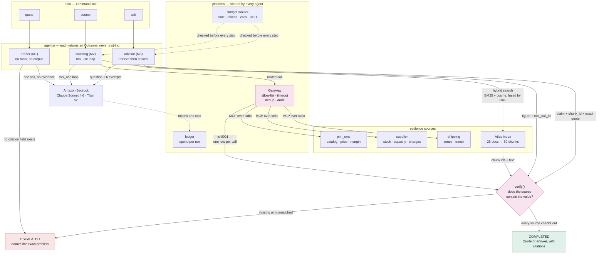

# HALO Quote Copilot

A practice agentic platform on AWS Bedrock: one seller request becomes a draft
quote where every number traces to a tool call or a cited document — or the run
escalates and says why.

**This is a learning build, not a production system.** All data is synthetic; no
HALO systems, credentials or customer records are involved.

Design and milestone plan: https://claude.ai/code/artifact/b3bf21a2-1e31-45c7-816b-66aa040ec8c3

## The flow

> Customer wants 500 hoodies, 3-colour front print, delivered to Chicago by
> Oct 15, budget $12k.

Answering that properly needs priced catalogue truth, supplier capacity on a
specific day, written decoration policy, a transit calculation and a margin
check — which is why it exercises an LLM, bounded agents, RAG, MCP tooling,
guardrails and shared identity all at once.

The full business domain — tenants, catalog, suppliers, margin policy, the
Atlas corpus, and exactly which of it is wired up versus still sitting unread
in the seed data — is in [docs/domain.md](docs/domain.md).

## Architecture

Three commands, three agents, one rule. Every agent must say where a value came
from, and the code checks the source really contains it before the run can
complete.



**Reading it.** The three paths differ only in where their evidence comes from.
M1 has none, so it cannot reach `COMPLETED` — `UngroundedDraft` has no field
that could hold a citation. M2 gets evidence from tools and cites a
`tool_call_id`. M3 gets it from retrieved chunks and cites a `chunk_id` plus the
exact sentence.

`verify()` is the same idea in both cases. It is not enough that the cited
source exists. The value has to appear in it. A model will cite a real tool call
for a number that call never returned, and it will name a real chunk for a
sentence that is not in it. Checking only the id would accept both.

## Stack

| Concern | Choice |
|---|---|
| Model | Claude Sonnet 4.6 on Amazon Bedrock (`global.anthropic.claude-sonnet-4-6`) |
| Harness | Our own reasoning loop, containerized onto Bedrock AgentCore Runtime |
| Vectors | SQLite + Titan v2 embeddings locally; pgvector behind the same `VectorStore` protocol when the corpus outgrows it |
| Tools | MCP servers over stdio, behind a gateway that allow-lists and audits |
| Guardrails | Bedrock Guardrails, plus an evidence envelope around all fetched text |
| Identity | Cognito → API Gateway JWT authorizer → `Principal` enforced at the tools |
| Infra | Terraform |

## Getting started

```bash
make install   # venv + editable install
make seed      # regenerate the synthetic corpus into data/seed/
make test
make lint
```

`data/seed/` is generated, not committed. The generator is the source of truth
and is deterministic — two runs on two machines produce identical files, so an
evaluation regression later is a real regression rather than a reshuffled
catalogue.

## Layout

```
src/halo/
  domain/      the synthetic HALO business: org, catalog, supply, atlas, quote, request
  platform/    contracts every agent obeys: identity, budget, outcome, bedrock, gateway, ledger
  rag/         chunk, embed, store, bm25, hybrid retrieve, ingest, evaluate
  evals/       golden sets the CLI runs
  agents/      one function per agent, each returning an Outcome
  seed/        deterministic corpus generator + the written Atlas corpus
  cli.py       `halo quote "..."`
tests/         schema, invariant, determinism, contract and agent tests
reference/     the earlier MCP sample this build grew out of
```

## Running a quote

First-time AWS setup is in [docs/aws-setup.md](docs/aws-setup.md) — about fifteen
minutes, and nothing it provisions costs anything while idle. Check it with:

```bash
halo doctor
```

That verifies credentials, region, model access and then makes one deliberately
tiny call, stopping at the first problem and naming the step that fixes it.


```bash
# M1 — ungrounded draft, always escalates
halo quote "Customer wants 500 hoodies, 3-colour front print, Chicago by Oct 15, budget \$12k."

# M2 — sourced from the MCP tool plane, every figure traced to a tool_call_id
halo source '{"product_description":"fleece hoodie","quantity":500,
              "decoration_method":"screen_print","imprint_colors":3,
              "ship_to_state":"IL","needed_by":"2026-11-30"}'

# M3 — a policy question answered from the Atlas corpus, quoted verbatim
halo ask "Can we rush a five colour screen print job?"

# M3 — the 20-question golden set (live, ~$0.15)
halo eval

# what this has cost so far
halo spend
```

Build the Atlas index once before `ask` or `eval`:

```bash
make ingest    # 25 documents -> 80 chunks, ~$0.0001
```

Needs AWS credentials in the environment and `anthropic.claude-sonnet-5` enabled
for the account in the chosen region (Bedrock console → Model access). The
command exits `2` on an escalation and `1` on a setup problem, and setup problems
print what to do about them rather than a stack trace.

At M1 every run escalates. That is the milestone working, not failing: the draft
is entirely invented, and design rule 02 says an uncited figure is not an answer.

## The rules the code enforces

1. **An agent returns an `Outcome`, never a string** — `completed`, `escalated`
   or `refused`, and a stop must carry a reason (`platform/outcome.py`).
2. **Evidence or escalate** — every figure in a `Quote` carries a `Citation`
   whose ref resolves to a document chunk or a tool call (`domain/quote.py`).
3. **Identity is a token that travels** — `Principal` is frozen at admission and
   enforced at the tool boundary, never by the agent (`platform/identity.py`).
4. **Tool output is data, never instruction** — arrives at M4.
5. **Budgets are enforced, not requested** — wall clock, tokens, tool calls and
   dollars, checked before every step (`platform/budget.py`).
6. **Approval resumes, it doesn't restart** — arrives at M6.

## Milestones

| | | Status |
|---|---|---|
| M0 | Scaffolding and a synthetic HALO | done |
| M1 | First Bedrock call — and a deliberately ungrounded quote | done |
| M2 | The MCP tool plane | done |
| M3 | Atlas RAG with real citations | done |
| M4 | Guardrails and the untrusted boundary | next |
| M5 | One principal, end to end | |
| M6 | Supervisor, bounded specialists, human approval | |
| M7 | Observability and evaluation gates | |
| M8 | Terraform up, Terraform down | |
