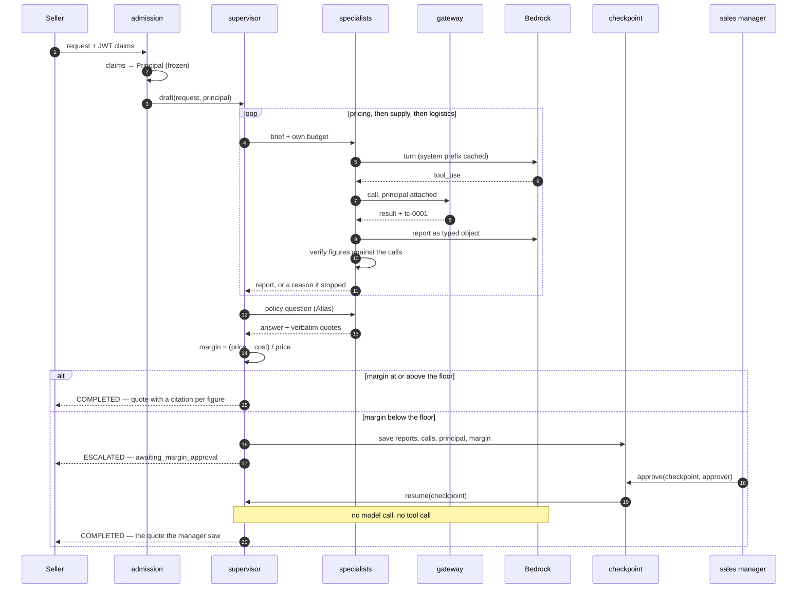
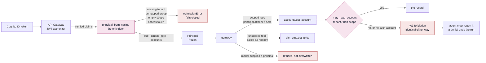
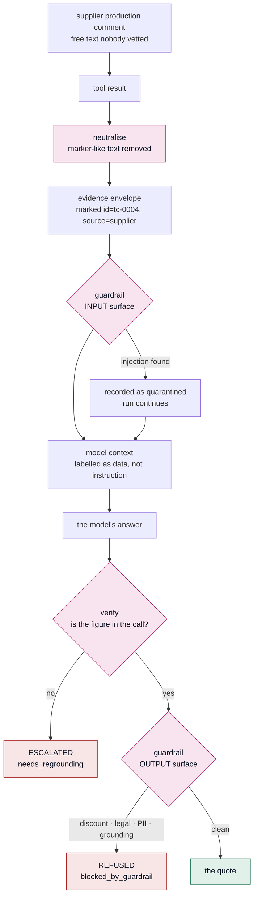
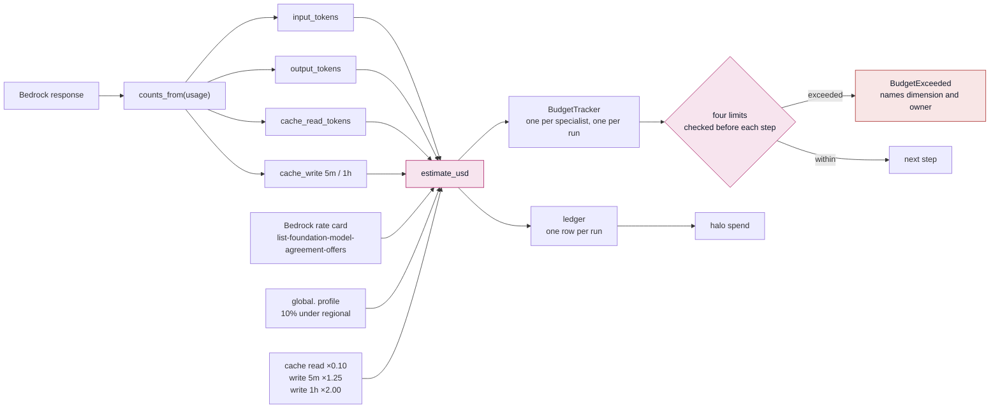
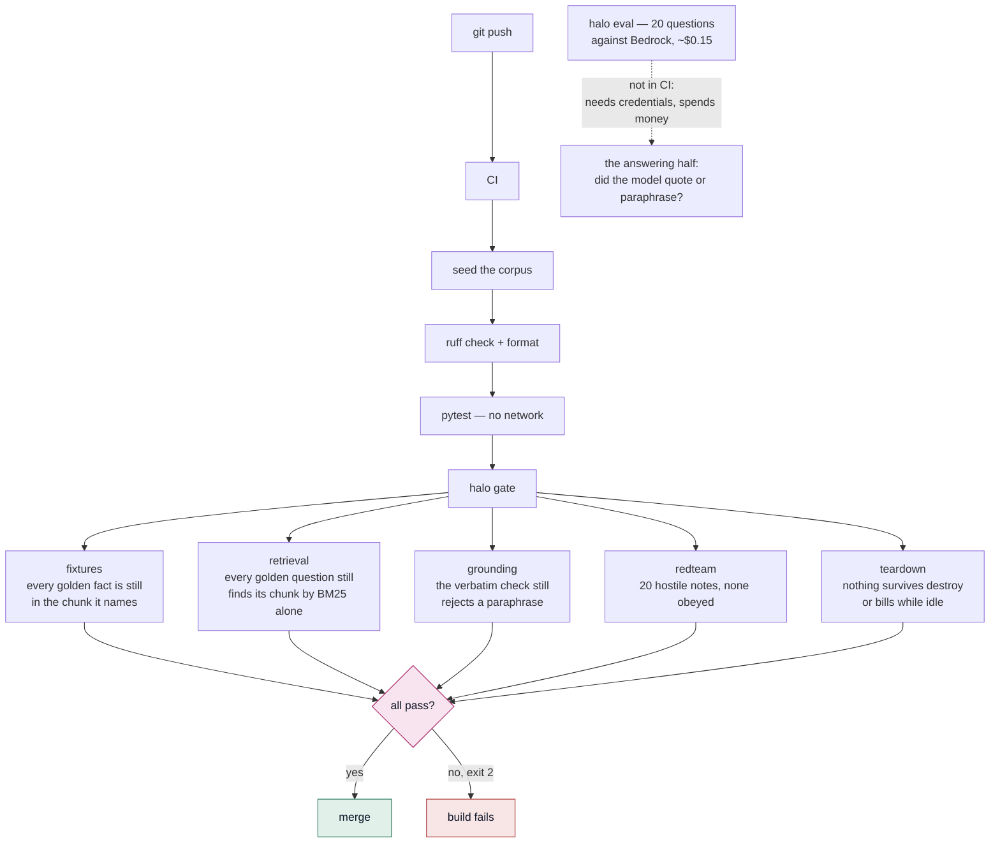
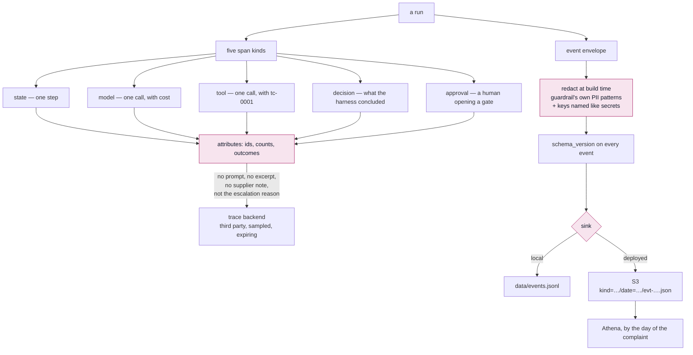
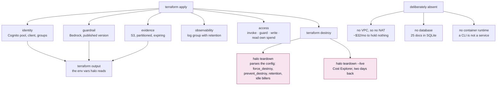

# Architecture, one question at a time

The system diagram in the [README](../README.md) shows what talks to what. These
answer the questions it cannot: how a request moves through the specialists, how
identity travels, what happens to text nobody vetted, what a call costs, what
fails a build, and what a run leaves behind.

Each diagram is followed by the thing it is trying to make obvious, which is
usually a decision rather than a component.

---

## 1. A request, end to end

**The `Note` is the point.** Resuming assembles the quote from the evidence
already in the checkpoint. `resume()` takes no client and no gateway, so it
cannot re-fetch even by accident — re-running after approval is the shortcut that
hides every state bug, because the second run gets slightly different answers and
the thing that gets sent is not the thing that was approved.

**Each specialist holds its own budget.** A runaway pricing loop cannot spend
supply's allowance, and when one exhausts its budget the reason names which.

---

## 2. Identity: a token that travels

**Out-of-scope and nonexistent return the same denial.** Distinguishing them
would turn the tool into a way to enumerate the customer list one id at a time.

**The model never supplies identity.** A `principal` argument in a tool call is
refused rather than overwritten — silently correcting it would work, and would
hide the attempt.

**A denial ends the run.** Enforced in the loop, not asked for in the prompt.
The failure it prevents is quiet: the model already holds the account from an
earlier turn, the tool says no, and it answers from what it is still holding.

---

## 3. The untrusted boundary

**Two mechanisms, because they fail differently.** Labelling a hostile note as
evidence does not stop the answer carrying a 40% discount; blocking the word
"discount" does not stop a note impersonating the operator.

**Neutralising is what makes the envelope real.** A note containing its own
closing marker would otherwise step outside the envelope and continue as though
the harness were speaking. The attempt is defanged, not deleted, so it stays
visible in the transcript.

**`REFUSED`, not `ESCALATED`.** An attack is not work for a human to approve and
must not reach the approval queue.

The red-team set runs all twenty of these through the real loop against a control
model that obeys every one. Sixteen are stopped by the guardrail, four by
verification — which has no concept of an attack and rejects a figure no tool
returned whatever put it there.

---

## 4. What a call costs

Measured from the ledger, counting only runs that actually reached Bedrock:

| Operation | Model calls | Cost | Runs | Dominated by |
|---|---|---|---|---|
| Atlas ingest | 80 embeds | $0.0001 | 1 | Titan at $0.02 per million tokens |
| Policy question `ask` | 1 | $0.0058 | 4 | six excerpts of context |
| Ungrounded draft `quote` | 1 | $0.0436 | 4 | long output, many assumptions |
| Golden set `eval` | 20 | $0.1693 | 3 | volume |
| Sourced quote `source` | 5–13 | $0.1718 | 11 | the loop resends the transcript each turn |

The last two are higher than the figures this project started with — $0.14 and
$0.15 — and the difference is not drift. Every system prompt has carried the
evidence rule since M4, on every call of every turn, which is a safety feature
with a price per token. `source` also has the widest spread of anything here,
$0.0992 to $0.2788, because the number of turns depends on how quickly the model
settles on a supplier.

**Cache tokens are added, not assumed included.** The API reports cache reads and
writes as counts separate from `input_tokens`. Reading only `input_tokens` prices
a cached call as though the prefix were free, and lets a run pass a token limit it
has already exceeded.

**Rates come from the account's own card, not the first-party price list.** The
two differ by about 10%, and the first-party figures under-reported this
project's spend.

**Caching is wired up and currently saves nothing.** The system prompt is sent
with a cache breakpoint and Bedrock accepts it, but a live golden-set run comes
back with zero cache reads: these prefixes are shorter than the model's minimum
cacheable length, so there is nothing to serve. `halo spend` grows two cache
columns the moment that changes. The accounting is in place; the saving is not,
and calling it the fix for expensive sourcing runs would be describing an
intention as a result.

**A model with no rate card entry cannot be used.** `BedrockClient` refuses to be
constructed for one: an unpriced call adds zero to `usage.usd`, so `max_usd` is
never reached and the run proceeds under a cap that has quietly stopped existing.

**A breach names whose budget it was.** Several are open at once — each
specialist's, and the run's, which the shared client and gateway count against.
"pricing exhausted its budget" when it was the run's sends someone to raise a
limit that was never reached.

---

## 5. What fails a build

**A grounding failure has three causes and two are deterministic.** The chunk
holding the answer stopped being findable; the golden set names a fact that is no
longer in its chunk; or the model paraphrased instead of quoting. Only the third
needs a model, so the first two are gated offline in about a second.

**The fixture gate catches the quiet rot.** A document gets reworded, the fact
moves to a neighbouring chunk, and nothing fails until someone runs the live eval
and reads a 17/20 as a model regression.

**The grounding gate catches what a live eval cannot see at all.** A verbatim
check that stopped checking makes the live score go *up*.

**Retrieval is gated lexically.** The vector half needs Titan and a network, so
the gate asserts something narrower and honest: the chunk is findable by BM25
alone. That is a weaker bar than production clears, which is what makes it fail
on a real regression rather than a ranking wobble.

---

## 6. What a run leaves behind

**Two records because they have different readers.** A trace goes to a
third-party backend read by whoever has the console, so the corpus does not
belong in one. Content goes in the bucket we control, redacted, for the auditor
who asks in eleven months.

**Redacted when built, not when read.** A bucket gets copied, granted to a data
team, and crawled by something nobody remembers enabling; "we redact on the way
out" holds only until the second reader.

**One pattern list, shared with the guardrail.** What the guardrail refuses to
say in an answer is what the record refuses to keep. Two lists would drift, and
the drift would be invisible — the guardrail is exercised by twenty red-team
notes on every build, and a redaction rule nobody tests is found by an auditor.

**The escalation reason is deliberately not on a span.** It is written by a model
or built from a tool error, which makes it the one field on an `Outcome` that can
carry text nobody vetted.

---

## 7. What gets deployed

**The absences are the design.** Each is a module the stack grows when there is
something to put in it; writing them now would be infrastructure with no caller.

**Cost Explorer is the authority on a teardown**, not Terraform state: what bills
afterwards is by definition what Terraform did not create — a log group a service
made on first use, a snapshot, an address allocated by hand during a demo.

**Two days back, because Cost Explorer lags.** A report run immediately after a
destroy would say zero and mean nothing.
